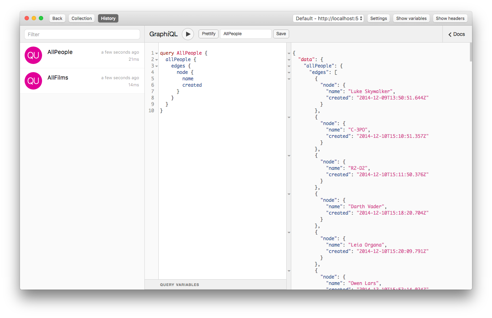
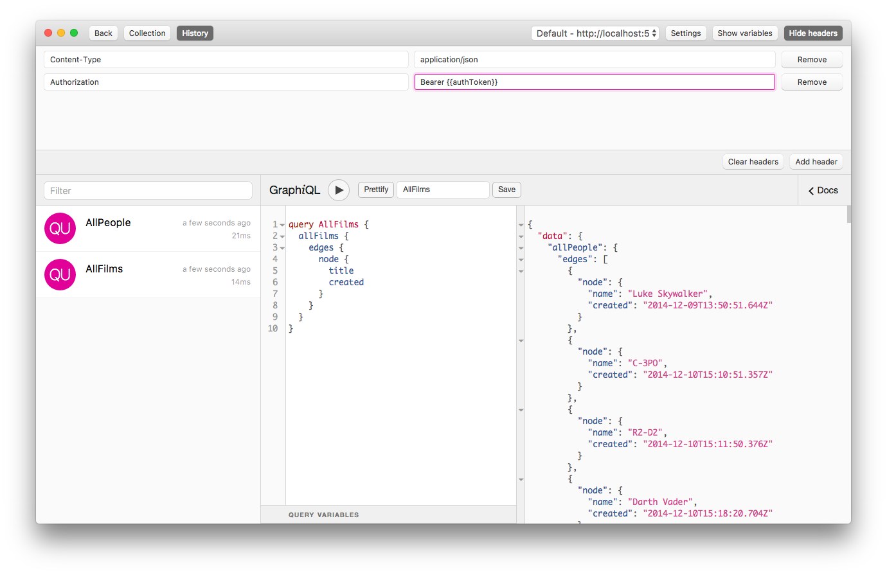
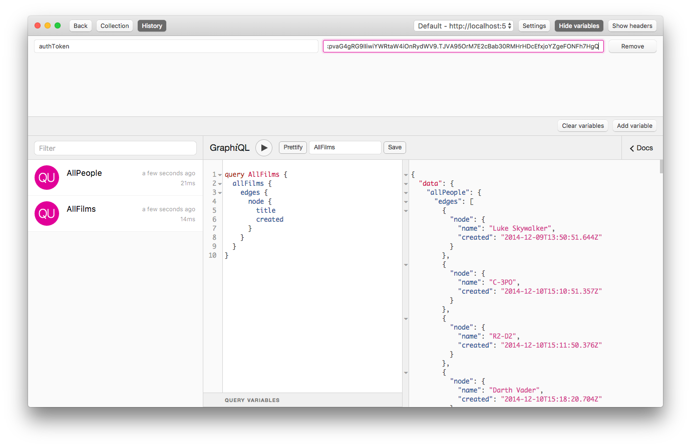
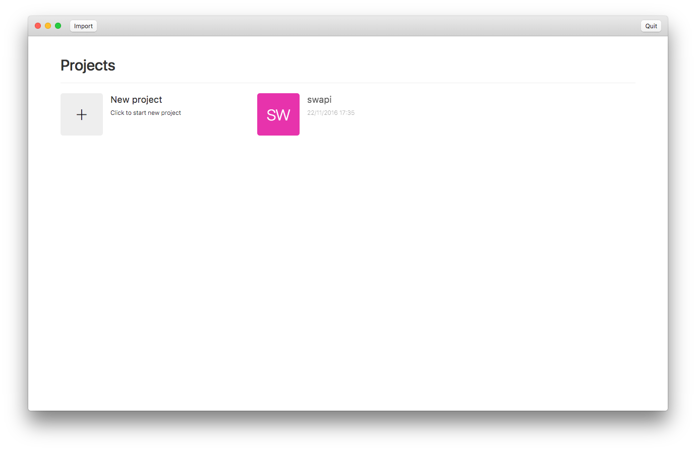

# GraphiQL App

*Be efficient at executing GraphQL queries*

## Features

- Manage projects
- Import/export
- Store queries
- Query history
- Custom headers
- Project variables for dynamic headers

## Installing

### MacOS

Unpack the latest app from the [releases][0] tab

### Window / Linux

Releases available soon, for now build the binary using

````
npm install
npm run package --all
````

## Contributing

Please file issues under GitHub, or submit a pull request if you'd like to directly contribute.

## Screenshots

Execute queries


Custom headers


Project variables for dynamic headers


Manage projects


[0]: https://github.com/redound/graphiql-app/releases